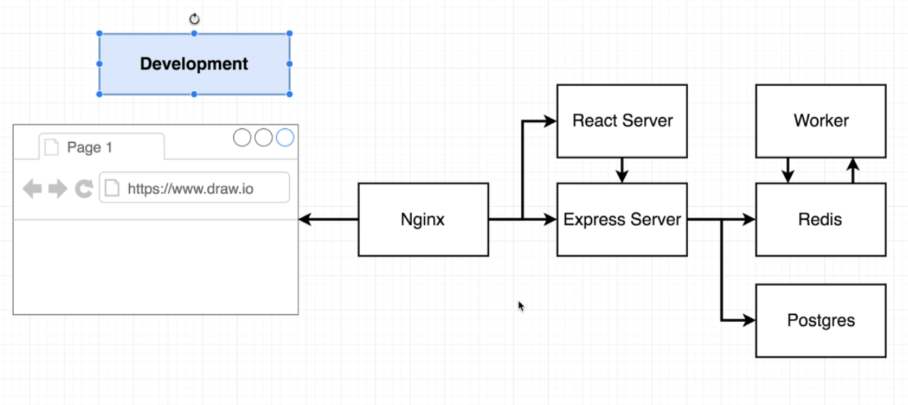
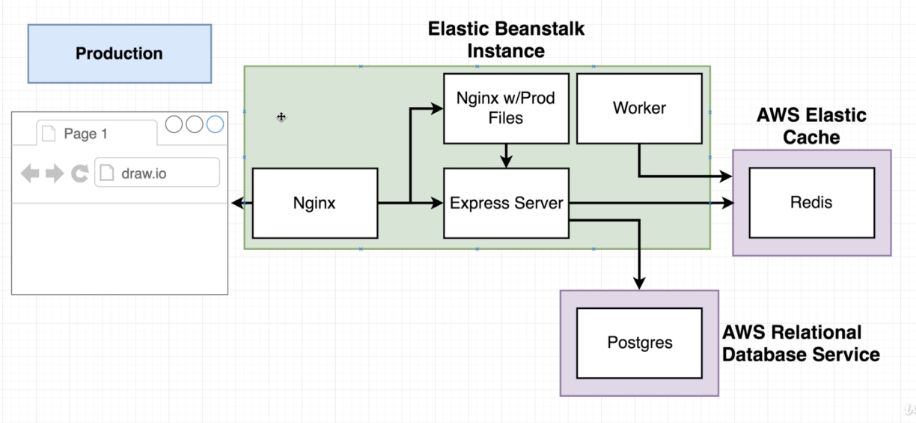

# Docker Multi Container Workflow 

## Architecture

- Postgres -> for permanent storage
- Redis -> for in memory storage
- worker -> calculates fibonacci

## nginx

- default.conf
- helps in mappings/routing
- incoming/outgoing requests redirection to frontend and backend
- serves local files
- backend is at 5000 PORT
- frontend is at 3000 PORT
- we'll listen on PORT 80

## travis

- run tests
- build prod images
- login to docker hub
- pushes to docker hub
- tells aws to use these images from hub

## docker hub

- contains our public and private repos
- [Link](https://hub.docker.com/u/meyash)

## elastic

- now we have many docker files
- so we now have to explicitely tell aws to pull files and run
- File : Dockerrun.aws.json
- this file is for amazon elastic container service
- AWS
  - choose multicontainer docker in env builder
  - use AWS Elastic Cache for redis (Recommended)
    - go to elastic cache
    - go to redis -> create
    - node type -> t2.micro, replicas -> none
    - check both subnets
  - use AWS Relational Database Service for postgres (Recommended)
    - go to rds
    - create postgres db
    - save the username, instance name, pass used while creation
  - create security group (firewall rules) for vpc
    - inbound rules
      - ports -> 5432-6379
      - source -> our sec group
    - in redis cache
      - modify -> add sec group
    - in rds
      - instances -> db -> modify -> add sec group
      - apply immediately
  - configuration  
    - instances -> modify -> add sec group
    - software -> modify -> add env vars from dockercompose file into here
      - REDIS_HOST -> go to redis cache : put in alias endpoint from there
      - PGHOST -> got to rds : put in endpoint from there
      - all others as saved by us earlier while creating rds and redis cache

## Dockerrun.aws.json

- hostname : service name defines in dockerfile
- essential
  - atleast 1 must be essential
  - if essential container fails, all others are closed automatically
- memory
  - ram req for service

