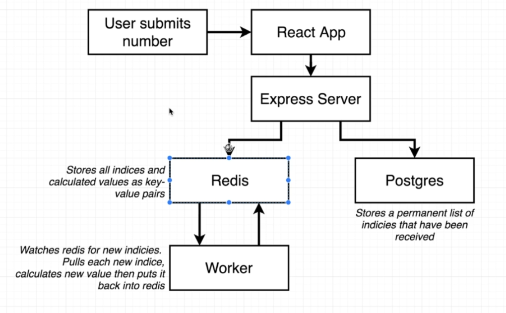

# Docker Multi Container Workflow

## Architecture

- Postgres -> for permanent storage
- Redis -> for in memory storage
- worker -> calculates fibonacci

## nginx

- default.conf
- helps in mappings/routing
- incoming/outgoing requests redirection to frontend and backend
- serves local files
- backend is at 5000 PORT
- frontend is at 3000 PORT
- we'll listen on PORT 80

## travis

- run tests
- build prod images
- login to docker hub
- pushes to docker hub
- tells aws to use these images from hub

## doker hub

- contains our public and private repos
- [Link](https://hub.docker.com/u/meyash)